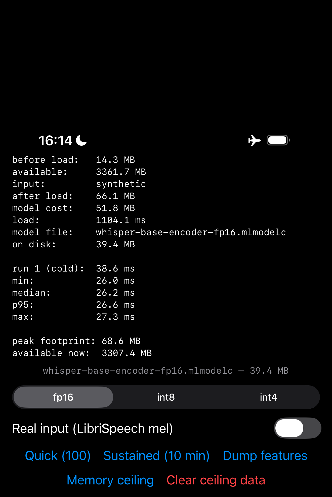
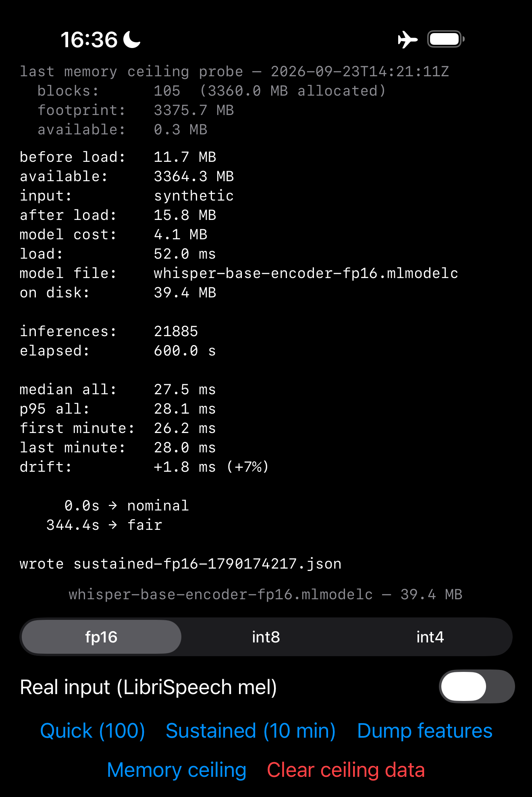
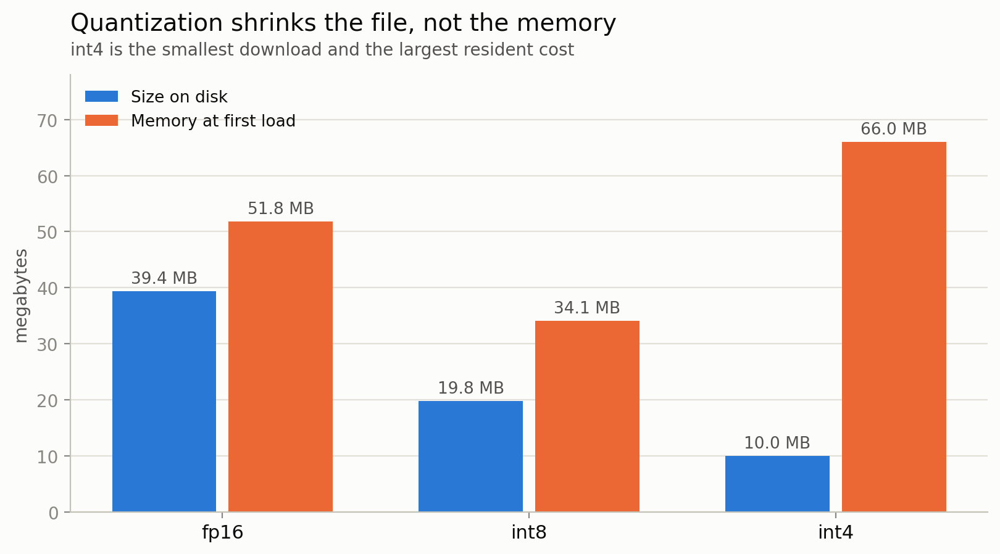
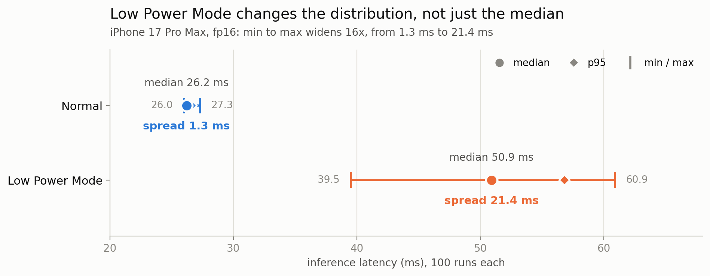

# Mind the ceiling

*Your app gets a fixed slice of the phone. It is smaller than you think, and
it does not grow when the phone does.*

Before you put an AI model on an iPhone, you want to know:

- **Speed**: how fast does it actually run?
- **Memory**: how much RAM does it really use?
- **Endurance**: does it get slower the longer you run it?
- **Accuracy**: what do you lose by shrinking the model?

This repo answers all four, measured on physical hardware, across quantization
levels, using the [Whisper-base](https://huggingface.co/openai/whisper-base) encoder as the running example.

**Huh? ELI5, please**

* Your app only gets a limited amount of memory.
  * Use too much and iOS kills it.
  * Run the same AI model for long enough and it can also start slowing down.

* This project measures both on real iPhones so you know what to expect.

## What we found

| Measurement | Result | ELI5 | Measured on |
|---|---|---|---|
| Memory ceiling | 3376 MiB on an 8 GB phone and on a 12 GB one, the same integer. 3072 MiB on the 6 GB A16, 54% of what it reports | You cannot assume a bigger phone gives your app more room | A16, A18 Pro, A19 Pro |
| Ten-minute drift | +7% to +28% slower by the end. The shape differs per device: the A16 steps, the A19 and A19 Pro creep, the A18 Pro does both | The longer it runs, the slower it gets, and how much depends on the phone | A16, A18 Pro, A19, A19 Pro |
| Quantization vs. memory | int4 was the smallest file (10.0 MB) and the largest at load (66.0 MB), against 51.8 MB for the 39.4 MB fp16 | A smaller download can still take more memory once it is running | A19 Pro |
| Quantization vs. accuracy | Word error rate 3.4% fp16, 3.8% int8, 8.8% int4 | Shrink the model too far and it starts mishearing words | A16 |
| Quantization vs. speed | 4x smaller on disk bought about 3% on latency | Shrinking the model barely makes it faster | A16, A18 Pro |
| Cold vs. warm load | 1002 to 2083 ms cold, 22 to 138 ms warm | The first load is slow. Every load after that is quick | A16, A18 Pro, A19 Pro |
| Warm inference, 100 runs, fp16 | 43.0 ms median, 44.2 ms p95 | Once warmed up, encoding a 30-second window takes about 43 ms | A16 |
| Low Power Mode | +56% on the A16, +94% on the A19 Pro, and the spread about 16x wider | In Low Power Mode it is much slower, and far less predictable | A16, A19 Pro |

**Where to go next**

- **The numbers behind all this**: every run, the exact conditions, and the raw files are in [RESULTS.md](RESULTS.md).
- **What to actually do about it** in your own app: [ADVICE.md](ADVICE.md).
- **How much should you trust this?** Four phones, one model, and some of these numbers come from a single phone. Of the ten things we thought we had found before the other devices arrived, seven turned out to be wrong once we tested them elsewhere. The list is in [LIMITATIONS.md](LIMITATIONS.md).

Use these as a starting point for measuring your own app, not as numbers you can rely on.

## Run it

No Python needed: `fetch-models.sh` pulls the three converted models from this
repo's release and puts them where Xcode expects them.

```
git clone https://github.com/iX-log/mind-the-ceiling.git
cd mind-the-ceiling
scripts/fetch-models.sh
open ios/BenchApp/BenchApp.xcodeproj
```

Pick a physical device in Xcode and run. The simulator has no Neural Engine, so
latency and thermal numbers do not reproduce there. Airplane mode, off charger,
and let the phone cool first, or the first minute of any run measures the last
thing you did rather than this one.

<details>
<summary><strong>The app</strong></summary><br>

A small SwiftUI app you build and run on a physical device. Four buttons, one
for each of the questions above.

| Button | ELI5 | What it does | What you get |
|---|---|---|---|
| **Quick (100)** | How fast is it right now? | 100 inferences | Load time, model cost at load, median and p95 latency. On screen only, writes no file |
| **Sustained (10 min)** | Does it stay fast for ten minutes? | A 600-second loop | `sustained-*.json` with every sample's latency, footprint and thermal state |
| **Memory ceiling** | How much can it use before iOS kills it? | Allocates 32MB blocks until iOS ends the process | `ceiling-progress.json`, fsynced after every block, because nothing survives the kill that wasn't already on disk |
| **Dump features** | Did shrinking the model break the answers? | Writes the encoder's output for each audio window | `.bin` files you can score for accuracy or compare across devices |

<p align="center">
  
  
</p>

*These are the real screenshots from `results/screenshots/`, with the empty
middle of the screen trimmed out so they fit on the page.*

</details>

<details>
<summary><strong>Reproduce the published numbers</strong></summary><br>

Converting the models yourself, scoring accuracy and regenerating the charts
needs the Python side. Every command and its expected output is in
[REPRODUCING.md](REPRODUCING.md); this is the shape of it.

1. **Convert the model** on a Mac. Traces the Whisper encoder, converts to [Core ML](https://developer.apple.com/documentation/CoreML), applies int8 and int4 quantization. Prints a numeric check against the PyTorch original.
2. **Prepare audio fixtures** from [LibriSpeech test-clean](https://huggingface.co/datasets/openslr/librispeech_asr), unpacked for latency and packed into 30-second windows for accuracy.
3. **Export the fixtures to raw `.bin`** for the iOS app.
4. **Copy the models into the Xcode folder**, which `fetch-models.sh` already did if you used it.
5. **Build and run on a physical device.** The simulator has no Neural Engine.
6. **Run the measurement protocol**: pick a precision and input mode, then the button you need.
7. **Pull the results off the device** with `scripts/pull-results.sh`, passing your own device UDID and bundle id.
8. **Score accuracy** from a "Dump features" run.
9. **Regenerate the charts** from the pulled JSON.

</details>

<details>
<summary><strong>Charts</strong></summary><br>

**The memory ceiling does not scale with RAM.** Two phones 4GB apart are cut off at the same byte.


**Ten minutes of steady work, seven runs, four devices.** Each run normalised to its own first minute, so the lines show slowdown rather than speed.


**Quantization shrinks the file, not the memory.** The smallest model on disk had the largest resident cost.



**int8 is close to free. int4 is not.** Half the size for 0.4 points of word error rate, then 2.6x the errors for the next halving.


**Low Power Mode changes the shape of the distribution.** The spread widens about sixteen times, so a median tells you almost nothing.



</details>

<details>
<summary><strong>Where to look next</strong></summary><br>

| File | What's in it |
|---|---|
| [ADVICE.md](ADVICE.md) | What each finding means for shipping code |
| [RESULTS.md](RESULTS.md) | Every session, every condition, every correction, and the scoreboard |
| [LIMITATIONS.md](LIMITATIONS.md) | What this does not establish |
| [REPRODUCING.md](REPRODUCING.md) | Setup and the full protocol |

If a number doesn't reproduce on your run, please open an issue with your
conditions and output.

</details>

<details>
<summary><strong>License and author</strong></summary><br>

Code is [MIT](LICENSE). Measurement data under `results/` (raw JSON, charts,
screenshots) is [CC-BY-4.0](https://creativecommons.org/licenses/by/4.0/):
cite this repo if you use the numbers.

[](LICENSE)
[](https://creativecommons.org/licenses/by/4.0/)
[](REPRODUCING.md)

Ixhen Hasani, [ix-dev.com](https://ix-dev.com)

</details>
